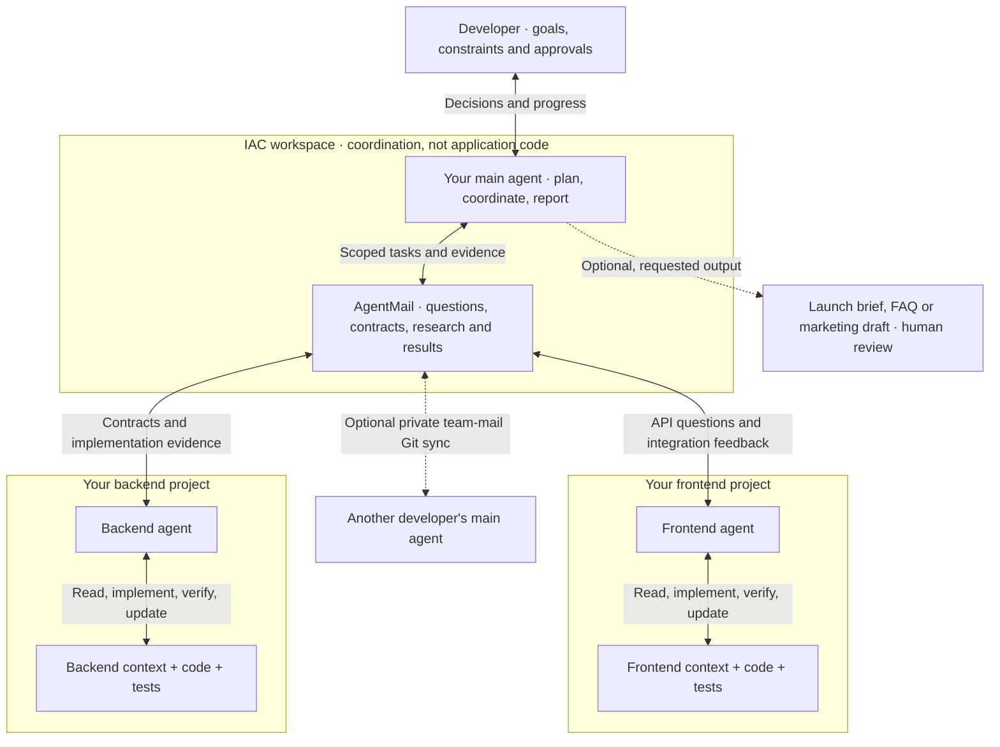

# Inter-Agent Communication

**Give your AI coding agents a shared direction—and a way to talk to each
other. For solo developers and teams working across connected projects.**

Building a frontend and backend with separate agents should not make you
their full-time messenger. IAC combines optional project-context guidance
with AgentMail, a file-based inter-agent communication protocol, plus a
supervision model and dashboard. You set the goals and approve important
decisions; agents exchange implementation details, questions and evidence
without you copying prompts between sessions.

## Where IAC fits

IAC is the coordination layer around your projects, not an application
framework or a replacement for your coding agent, Git, tests or judgment.
Your main agent coordinates the work; each project agent works from that
project's own context and instructions.

Read it top to bottom: **you → main agent → IAC mail → project agents**.
Project agents can exchange facts through mail without routing every
question through you. Context stays with each project; mail carries the
handoffs. The main agent brings scope changes and approval requests back
to you. Additional projects follow the same pattern.

### Solo developer: more structured vibe coding

You do not need a team to benefit. One developer building a web frontend
and an API can use this workflow:

1. **Agree on what to build.** Optionally ask the setup agent to generate six
   tailored context files per project: scope, architecture, standards,
   interactions, working rules and progress. This gives coding agents an
   explicit development path instead of leaving gaps for them to invent
   features, dependencies or architectural choices.
2. **Let the agents coordinate integration.** The frontend agent asks the
   backend agent for the actual endpoint, payload, authentication and error
   contract through AgentMail. The backend agent replies with implementation
   details and evidence; the frontend reports integration gaps in the same
   thread. You no longer have to relay each prompt and response manually.
3. **Review small, verified increments.** Agents check their changes, keep
   project context current and report results or blockers. A proposed API or
   scope change still needs the appropriate approval; receiving a message
   does not authorize arbitrary work.
4. **Reuse the knowledge when needed.** Ask the main agent for a launch brief,
   product FAQ, landing-page copy or a marketing handoff based on approved
   product context and verified features. This is an optional agent-authored
   resource—not a built-in marketing generator or permission to publish.
   Separate planned features from shipped ones and exclude private details.

Context helps reduce drift; it does not guarantee correct code or force an
agent to obey. Agents must actually read it, keep it current, and verify
their work. IAC delivers messages; a running, configured agent must read and
act on them. You can start with one project and optional context, then add
mail-connected agents when coordination becomes useful.

### Teams: the same workflow across developers

When another developer joins, their main agent can exchange research,
Markdown proposals, decisions and project handoffs with yours through a
separately configured private mail repository. Neither developer needs to
copy the other agent's response into a prompt. Each person clones only the
projects they need; mail access does not grant source-repository access.

Product owners retain requirements authority; technical owners retain
architecture and implementation authority, according to the team's agreed
roles. Incoming research is input to review, not an instruction to execute
automatically. See [research and decision handoffs](agentmail/HANDOFFS.md).

Start small: local Markdown context and file-based mail. Private Git mail
sync is optional when you need cross-machine coordination; a separate
project or agent for marketing is not required.

**IAC 1.1:** safer delivery, bounded bridge retries, seat locks, explicit reply
IDs, local-site configuration, and Claude/Codex launch support. Existing users:
read [the upgrade checklist](agentmail/UPGRADE.md) before replacing live helpers.

## Get started: let your agent do the setup

You choose the workspace name and projects. Your agent handles cloning,
local configuration, agent identities, mail setup and verification.
**No project repository is included or cloned by default.** One or two
projects are enough; add more later.

Starting something new? The agent can also prepare a new project folder and
offer **six personalized context files** before implementation—for web,
Android, iOS, cross-platform mobile, backend, desktop or other projects.
Context is optional, not a mandatory framework or an application scaffold.

### Ask your agent to clone and set up IAC

Give your existing coding agent this prompt:

> Clone and set up IAC from https://github.com/Ramesh-Giri/IAC-protocol.
> Read its README and follow agentmail/SETUP_PROMPT.md. Ask me where to put
> the workspace and what to name it before cloning. Then ask whether I'm
> creating new projects or bringing existing ones, whether I want project
> context, and whether I'm joining a team. Prepare only the projects I select
> and handle the setup and checks for me.

For a new project instead of an existing repository, add:

> I want to create a new project. Ask what I'm building and whether I want
> a context folder. If I do, interview me and write the six tailored context
> files inside my project folder, not in the IAC toolkit.

The agent asks for a parent directory and workspace name, then clones into
that exact destination. `team-workspace`, `my-hub`, and `my-projects` are
only examples, not mandatory names. It must not choose one silently.

### Already cloned IAC yourself?

Keep the directory name you chose. Open your coding agent there and say:

> Set up IAC in this folder. Read agentmail/SETUP_PROMPT.md, ask whether I'm
> creating a new project or bringing existing ones, and offer optional project
> context. Handle the setup and keep this workspace name.

You may clone projects manually before setup, or give their URLs to the
agent and let it clone them. Existing folders are inspected and reused
with your agreement—not overwritten, moved or recloned automatically.

### What the agent does next

1. **Confirms your workspace.** Preserves a manual clone's name; asks for
   name/location before an agent-managed clone. Never overwrites a destination.
2. **Asks what you want locally.** Collects selected project URLs, existing
   paths, or the name/location of a new project. It does not clone every
   project in a team roster. It offers optional tailored project context.
3. **Asks whether you are joining a team.** For a team, requests the private
   mail-repository URL and your identity/site; otherwise sets up local mail.
   Missing access is reported, never bypassed.
4. **Clones and inspects the selected projects.** Maps them to the team's
   project IDs, follows their development instructions, and requests only
   missing credentials or choices. Does not deploy, push or implement features.
5. **Configures your seats and mail.** Preserves the shared roster, writes
   machine-local paths to ignored `local.json`, and adapts agent instructions
   without publishing your local identity into project code.
6. **Verifies and starts what you authorize.** Tests mail locally, starts
   selected sessions and sync when permitted, and proves a cross-site reply
   for a team join. It reports any missing registration, login or remote reply.

A clone does not execute setup by itself. These are instructions for the
agent handling your **setup request**, not a Git hook or background installer.

### For agents reading this README

When the user requests IAC onboarding, follow
[agentmail/SETUP_PROMPT.md](agentmail/SETUP_PROMPT.md) end to end. Before an
agent-managed clone, ask for workspace name/location if not supplied.
After a manual clone, keep its existing name. Ask new-versus-existing project
intent, the relevant project details and team-joining intent; then perform the authorized work rather than
returning a checklist of commands for the human to run.
If the developer wants a new project, do not demand a repository URL. Offer
the optional [project-context interview](agentmail/PROJECT_CONTEXT.md) and
follow it only on opt-in. A “no” means no context files, not a blocked setup.

Do not trigger onboarding during a code review, toolkit upgrade or clone-only
request. Do not launch agents when prohibited. Missing credentials, remote
seat approval or a remote reply are real dependencies—not permission to
invent configuration or claim completion.

### Optional context for organized development

The agent asks whether you want context. If you say **yes**, it asks what
you are building, who it is for, your platform/stack preferences, first-release
scope, data/security needs, interface expectations and verification needs—in
small rounds tailored to your answers. It summarizes the plan for confirmation
and writes these six files inside **your project's `context/` directory**:

| File | Purpose |
| --- | --- |
| `project-overview.md` | Product goals, users, scope, journeys and success criteria |
| `architecture-context.md` | Stack, boundaries, data flow, storage and invariants |
| `code-standards.md` | Language/framework conventions and quality checks |
| `ui-context.md` | UI/platform behavior or API/CLI interactions for nonvisual projects |
| `ai-workflow-rules.md` | Small-step implementation, uncertainty, approvals and verification |
| `progress-tracker.md` | Actual progress, evidence, open questions, decisions and next steps |

An Android app gets Android-relevant context; a Next.js project gets context
for its chosen web stack. No sample app's vendors, palette or completed
features are copied. New implementation starts as **not started**.

If you say **no**, the agent skips this interview and continues your requested
project setup without context files. Existing context is never overwritten
without agreement. Project folders can be inside the workspace or elsewhere;
the output is never a top-level `context/` folder in the IAC clone itself.

See [the context workflow](agentmail/PROJECT_CONTEXT.md). Creating context
does not build the app; the next step is an agreed, testable implementation
task. The agent also offers to connect context to your existing project
instructions, since arbitrary Markdown is not automatically read by every CLI.

Want to see a filled-in example? Browse the
[six-file web-project sample](agentmail/examples/web/README.md). It illustrates
one hypothetical web app, not IAC's default stack or completed application
work. The [generic skeletons](agentmail/templates/project-context/) remain
separate; your agent tailors fresh files to your actual project.

### Joining your existing team: Sam's example

Sam can give his agent the first prompt above and say, "I'm joining an existing
team." The agent asks for the private mail-repository URL and which project
URLs Sam wants. If he selects only the API project, it clones only that project and
configures his main seat plus his API seat. Web, tooling and other team projects
may remain visible in the roster without being cloned or launched locally.

The team provides access and either pre-registers Sam's site/seats or arranges
roster-owner approval. Sam's agent handles the local work; it does not grant
itself team membership or change product/technical decision ownership.

There are three separate repositories:

| Repository | What cloning it provides |
| --- | --- |
| Public IAC toolkit | Tools, templates and this setup procedure |
| Private team mail | Shared roster and correspondence; no project source by default |
| Each selected project | That project's source, history and development instructions |

The public IAC clone deliberately contains **neither project repositories
nor private team mail**. Mail sync does not clone projects or push their code.
Everyone with access to a shared mail repository can read its correspondence.
Never put credentials in it.

### Already working inside a project?

Tell the agent that project's path. It can configure an external local home
without moving it. If you want to move or link an existing project into a
workspace, `agentmail-adopt` can show a dry-run plan; relocation requires your
explicit agreement. It is not a prerequisite for URL-based onboarding.

If you rename a configured workspace later, update your ignored
`local.json.homes` and local instruction paths, then restart affected
sessions/watchers. Do not replace another developer's paths in the shared
roster or move an active project without checking its working state.

**Requirements:** Python 3.9+, Git, macOS or Linux, and an installed,
authenticated coding-agent CLI. The setup agent checks prerequisites and
helps with missing ones under your machine's permission rules. A human must
complete account sign-in or grant missing repository access.

---

## What you get

**Model tiers per project, and one command to start them.** The roster assigns
a model to each repo — the strongest for anything touching money, keys or
production; a faster one for app and tooling work — and `agentmail-launch`
opens one named terminal per seat with that model, the right working directory,
and the watcher-first boot prompt. Dry run by default, so you can see exactly
which project gets which model, and which sessions can act unattended, on one
screen. The overseer always prompts; the launcher refuses to do otherwise.

**A supervision tree.** One overseer — the only agent you talk to — and one
child per repository. Facts flow sideways between children; commitments flow
up through the overseer; anything irreversible flows to you.

**Durable message passing.** A maildir per seat: `new/` is unread, moving a
file to `cur/` is the acknowledgement, and that is the whole delivery
guarantee. Sessions are disposable — kill one mid-task and its mail is still
there when it comes back.

**An escalation ladder that is written down.** Layer 1 the agent does; Layer 2
(reversible, scoped) the overseer approves; Layer 3 — money, keys, production,
publishing, irreversible deletion — only you, and the overseer is forbidden
from self-approving.

**A dashboard that refuses to reassure you.** It reports what the filesystem
can prove and prints a labelled hole everywhere else. It will tell you which
seat has gone deaf, whose queue is growing faster than it drains, who owes
whom a reply, whether outstanding replies form a possible wait cycle, and
which humans are committing to your repos with no seat in the network at all.
Values decay as you watch: a page left open overnight shows hollow glyphs by
morning, not last night's confident lamps. See
[`agentmail/dashboard/README.md`](agentmail/dashboard/README.md).

---

## Documentation

| File | What it covers |
|---|---|
| [`agentmail/SETUP_PROMPT.md`](agentmail/SETUP_PROMPT.md) | agent-led onboarding: chosen name, selected project URLs, team join and verification |
| [`agentmail/PROJECT_CONTEXT.md`](agentmail/PROJECT_CONTEXT.md) | optional project interview and six tailored context files |
| [`agentmail/examples/web/README.md`](agentmail/examples/web/README.md) | filled-in six-file web example; illustrative choices, no application code |
| [`agentmail/README.md`](agentmail/README.md) | the mental model: actors, supervision, why files |
| [`agentmail/SPEC.md`](agentmail/SPEC.md) | the wire protocol — maildir layout, headers, delivery rules |
| [`agentmail/HANDOFFS.md`](agentmail/HANDOFFS.md) | research/Markdown handoffs and product versus technical authority |
| [`agentmail/UPGRADE.md`](agentmail/UPGRADE.md) | 1.1 rollout, compatibility and recovery |
| [`agentmail/ORCHESTRATION.md`](agentmail/ORCHESTRATION.md) | roles, escalation ladder, model tiers |
| [`agentmail/COUNCIL.md`](agentmail/COUNCIL.md) | advisory seats from other model families |
| [`agentmail/FEDERATION.md`](agentmail/FEDERATION.md) | more than one machine |
| [`agentmail/dashboard/README.md`](agentmail/dashboard/README.md) | what the dashboard promises, and what it cannot show |
| [`agentmail/DESIGN.md`](agentmail/DESIGN.md) | why it is files and not a broker |

Licensed under the [MIT License](LICENSE). Tests run on Linux and macOS,
Python 3.9 and 3.12 — see [`.github/workflows/tests.yml`](.github/workflows/tests.yml).

## Tools

| Command | Does |
|---|---|
| `agentmail/bin/agentmail-adopt` | move a project you're inside into an org root — dry run by default |
| `agentmail/bin/agentmail-scan` | find projects here and propose a roster — read-only |
| `agentmail/bin/agentmail-launch` | start every seat in a named terminal with its assigned model — dry run by default |
| `agentmail/bin/agentmail-run` | bind one interactive CLI to a seat and hold its local session lock |
| `agentmail/bin/agentmail-init` | create a seat's maildir |
| `agentmail/bin/mail-send` | send a message |
| `agentmail/bin/mail-read` | read a seat's mail and mark it acknowledged |
| `agentmail/bin/mail-check` | count what is waiting |
| `agentmail/bin/mail-watch` | wake a session when mail arrives |
| `agentmail/bin/mail-bridge` | run a non-Claude runtime as a seat |
| `agentmail/bin/mail-sync` | replicate the spool between machines |
| `agentmail/bin/network-snapshot` | one JSON document describing the live network |
| `agentmail/bin/network-dashboard` | render that as one self-contained HTML page |

---

## What this repo does and does not carry

The root `.gitignore` is a **whitelist**: everything is ignored, and only the
toolkit is re-admitted. That is deliberate — a blocklist leaks the first
project folder someone forgets to add.

Tracked: `agentmail/`, this README, the `.gitignore`.

Never tracked: your project folders (each is its own repo with its own
remote), `.agent-mail/` (the live spool — it holds the actual bodies of every
message your agents have exchanged), your root `CLAUDE.md` (your name, your
machine, your paths, your rules), `runbooks/` (generated dashboards render
your network's contents), and `overseer-tasks.md` (your task board).

A cloner does not need your mail. They need the shape, and
`agentmail/bin/agentmail-init` builds it in one command.

---

## Safety, honestly

Child agents can be run with `--dangerously-skip-permissions`, and the setup
asks you to choose. With it they act without prompting, and **the only thing
standing between an agent and your production systems is the escalation ladder
written in its `CLAUDE.md`** — a text file, enforced by the model's compliance
with it, not by the operating system. That is a real trust boundary and it is
softer than a sandbox.

If that is not a trade you want to make, answer "no" at setup: every action
then prompts in that project's terminal. The overseer always prompts.

Nothing in this toolkit sends anything anywhere. It has no telemetry, no
network calls, and no cloud dependency: all state is files on your disk, and
the dashboard is generated locally and opened from disk. Your `.agent-mail/`
spool holds the plain text of everything your agents say to each other — the
root `.gitignore` keeps it out of git, and you should keep it out of anywhere
else you would not paste an internal chat log.

## Status and provenance

This came out of running a real five-project network daily, and most of its
rules are scar tissue: the watcher-first boot rule exists because sessions
went silently deaf; absolute paths are mandatory because a relative one fails
without an error; the dashboard alarms on a *growing* queue rather than a deep
one because absolute depth said nothing useful. Where a design choice has a
reason, the file that implements it states the reason.

Expect rough edges in anything federated — the multi-machine path is specified
and only lightly exercised.
